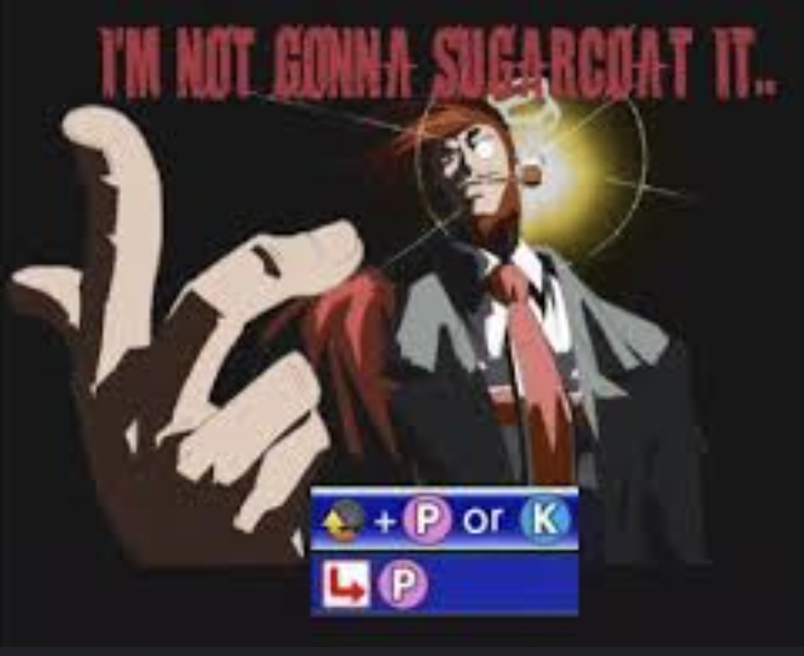
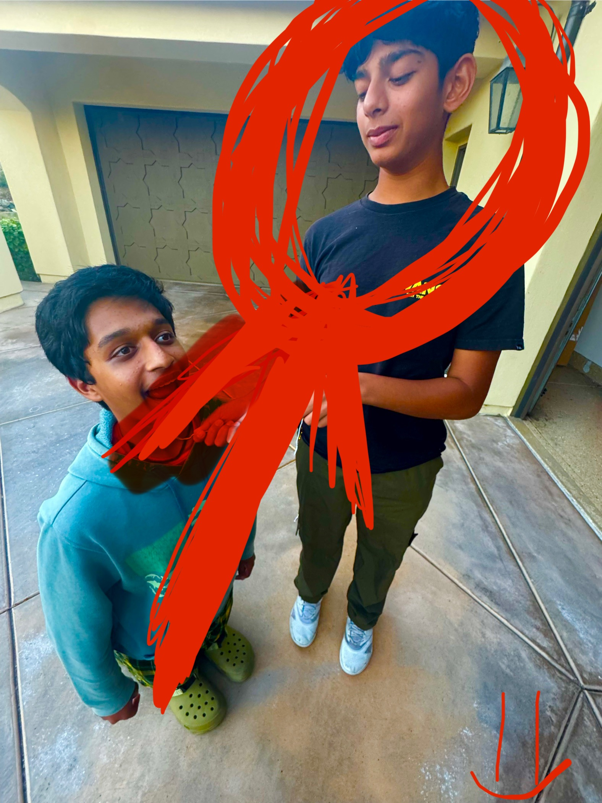

<h1>Variables Lesson Homepage</h1>
<b1>Below is a series of links to each one of the notebook files in this lesson.</b1> 
<a href="https://Nikhile22427.github.io/MortsMonkeys/2025/01/09/lessonBook1_IPYNB_2_.html" style="display:inline-block; padding:10px 20px; color:rgb(139, 238, 255); background-color:rgb(61, 104, 112); border-color: rgb(139, 238, 255); text-decoration:none; border-radius:5px;">Lesson 1</a>  
<a href="https://Nikhile22427.github.io/MortsMonkeys/variables/lessonBook2" style="display:inline-block; padding:10px 20px; color:rgb(139, 238, 255); background-color:rgb(61, 104, 112); text-decoration:none; border-radius:5px;">Lesson 2</a>  
<a href="https://Nikhile22427.github.io/MortsMonkeys/variables/popcornHax" style="display:inline-block; padding:10px 20px; color:rgb(139, 238, 255); background-color:rgb(61, 104, 112); text-decoration:none; border-radius:5px;">Popcorn Hax</a>  
<a href="https://Nikhile22427.github.io/MortsMonkeys/variables/popcornHaxAnswerKey" style="display:inline-block; padding:10px 20px; color:rgb(139, 238, 255)); background-color:rgb(61, 104, 112); text-decoration:none; border-radius:5px;">Popcorn Hax Answer Key</a>  
<a href="https://Nikhile22427.github.io/MortsMonkeys/variables/homework" style="display:inline-block; padding:10px 20px; color:rgb(139, 238, 255); background-color:rgb(61, 104, 112); text-decoration:none; border-radius:5px;">Homework</a>  

     
<b1>Secret?</b1>
 

    <button class="custom-button" ></button>
    

        <iframe width="100" height="100" src="https://www.myinstants.com/instant/prowler-sound-effect-83389/embed/" frameborder="0" scrolling="no"></iframe>
    

<a href="https://Nikhile22427.github.io/MortsMonkeys/secret/">The Prowler Calls</a>

